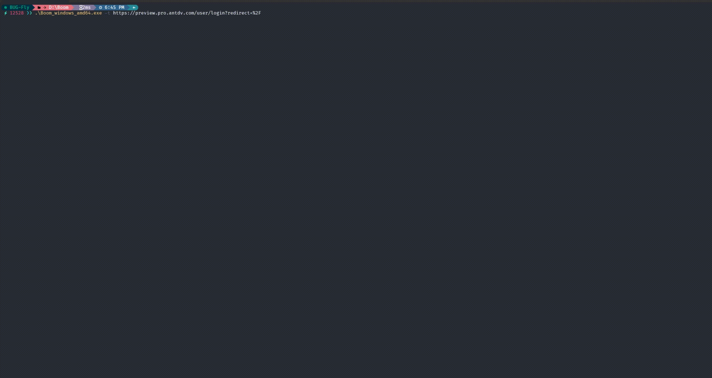

<h1 align="center">💥 I'm Boom 💥</h1>
<p>
  
  
  
</p>


## 👑 Boom 简介

**Boom** 是一款基于无头浏览器的 Web 弱口令爆破工具。它具有以下特性：

- 自动识别网页是否是登录页面
- 支持 URL 批量并发爆破
- 支持单 URL 并发爆破
- 多种爆破模式：**密码优先**和**用户名优先**

- [ ] 支持验证码组件识别


## ✨ Demo




## 🚀 快速使用

**在使用之前，请务必阅读并同意 [License](https://github.com/chaitin/xray/blob/master/LICENSE.md) 文件中的条款，否则请勿安装使用本工具。**

1. 单个URL爆破：

   ```bash
   Boom -t https://www.example.com/login.html --us users.txt --ps ./passwords.txt
   ```

    - `-t` ：指定单个爆破目标
    - `--us` ：指定用户名字典
    - `--ps`：指定密码字典

   > 注意：在未显示使用 `-m` 参数时将使用默认爆破模式——**密码优先**

2. URL 批量爆破

   ```bash
   Boom --ts targets.txt --us users.txt --ps passwords.txt
   ```

    - `--ts` ：指定爆破目标的字典
    - `--us` ：指定用户名字典
    - `--ps`：指定密码字典


## 📒 配置文件介绍

```yaml
# Version: 0.1

max_boom_concurrent: 2                                                  # 最大同时爆破的目标个数
boom_target_path: "" 													# 爆破目标字典路径
browser_config:															# 浏览器配置
    browser_model: local												# 浏览器模式
    chrome_bin_path: ""													# 浏览器可执行文件所在路径
    chrome_temp_dir: ./chrome_temp										# 浏览器临时文件存储目录
    disable_headless: false												# 禁用无头模式
    disable_images: true												# 禁用图片
    leak_less: true														# 实验性参数：防止内存泄露
    no_sandbox: true									                # 是否使用沙盒：Linux 以 root 用户运行的情况下设置为 true 
    proxy: ""															# 浏览器代理
    running_chrome:														# 正在运行的浏览器：如果启用， Boom 将会接管正在使用的浏览器
        enable: false
        ip: ""
        port: 0
    user_agent: ""														# 浏览器 UA
logger_config:															# 日志配置
    logger_level: "info"												# 默认日志等级	
    logger_time_format: 2006/01/02 15:04:05								# 日志输出时间格式
    logger_file_name: ./log/boom.log									# 日志文件存储路径
    logger_output_level: []												# 输出到文件中的日志等级
    logger_file_max_size: 50											# 日志文件最大体积：单位 MB
    logger_file_max_backups: 5											# 日志文件最大备份个数：单位 个
    logger_file_max_age: 30												# 日志文件最大存储时长：单位 天
    logger_prefix: ""													# 日志前缀
global_boom_config:														# 全局爆破配置
    boomConCurrent: 2													# 单个爆破目标的爆破并发数
    boomModel: 2														# 爆破模式：1.用户名优先--用户名跑字典，密码固定；2.密码优先--密码跑字典，用户名固定
    boomTarget: ""														# 爆破的目标
    userNamePath: ""													# 用户名字典路径
    passwordPath: ""													# 密码字典路径
```

